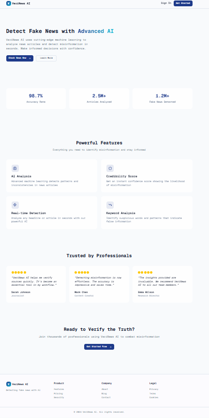
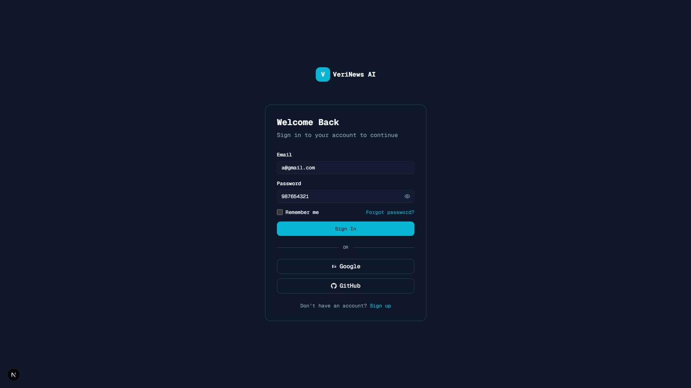
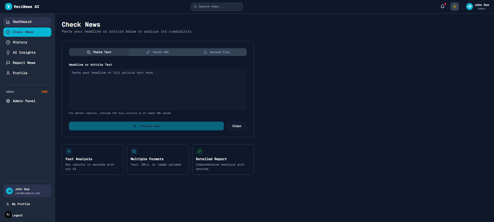
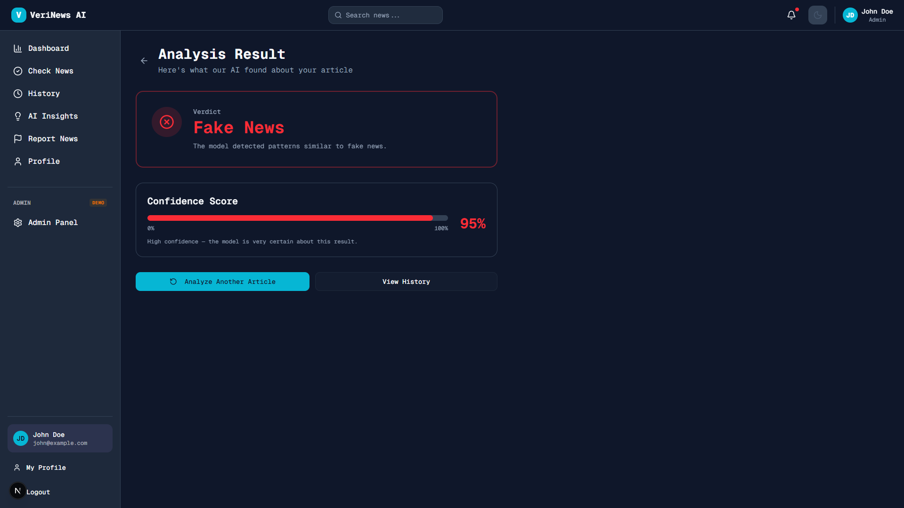
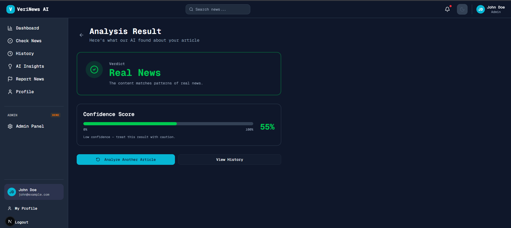
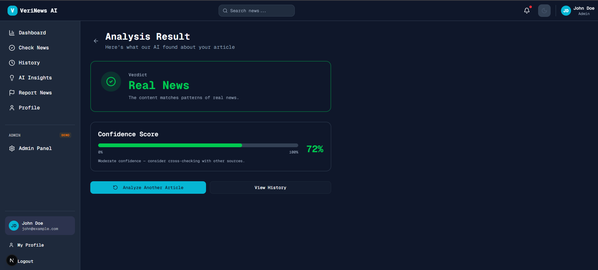
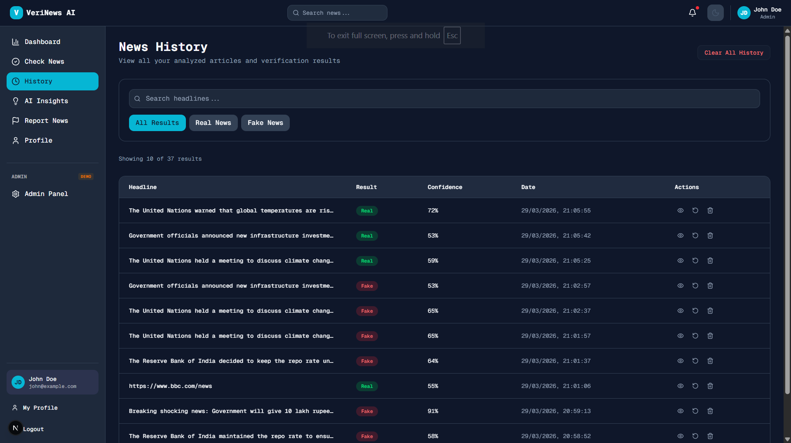

# 🧠 VeriNews AI – Fake News Detection Platform

> An AI-powered full-stack web application to detect fake news using Natural Language Processing (NLP) and Machine Learning.


---

## 📌 Overview

**VeriNews AI** is a comprehensive Full Stack Web Application designed to detect whether a news article, headline, URL, or image is **Real** or **Fake** using Artificial Intelligence and Natural Language Processing (NLP).

This project is developed as part of a **Full Stack Web Development (FSWD)** academic project and features a modern AI-powered web platform with professional dashboard interface, user authentication, and advanced ML capabilities.

---

## 🎯 Objective

- Detect fake news using AI-based techniques with high accuracy
- Help users verify news authenticity through multiple input methods (text, URL, image)
- Reduce the spread of misinformation with confidence scoring and uncertainty handling
- Provide a complete user experience with authentication, history tracking, and analytics

---

## 🚀 Features

### 🔍 Core AI Features
- **Multi-Input Analysis**: Analyze news articles, headlines, URLs, or images
- **Advanced ML Model**: LinearSVC with TF-IDF vectorization and bigram features
- **Confidence Scoring**: Display prediction confidence with uncertainty handling
- **URL Extraction**: Automatic content extraction from news websites
- **Image OCR**: Text extraction from news screenshots using pytesseract
- **Real-time Prediction**: Node.js + Python integration for instant results
- **Uncertainty Detection**: Returns "Uncertain" for low-confidence predictions

### 📊 Dashboard Features
- **Analytics Dashboard**: Key statistics and visualizations
- **Fake vs Real Distribution**: Interactive charts showing news patterns
- **Trending Topics**: Insights into misinformation trends
- **User Activity**: Personal analysis history and patterns

### 🧾 History Management
- **Persistent Storage**: MongoDB-backed analysis history
- **Detailed Records**: Store input type, prediction, confidence, and timestamp
- **Search & Filter**: Find previous analyses easily
- **Re-analysis**: Re-check previous entries

### 📢 Reporting System
- **Report Suspicious Content**: Submit URLs, text, or images for review
- **Category Classification**: Select report type (misinformation, satire, bias, etc.)
- **Admin Review**: Reported content goes to admin dashboard for moderation

### 👤 User Features
- **JWT Authentication**: Secure login/signup with token-based sessions
- **Profile Management**: Update user information and preferences
- **Dark Mode Toggle**: Theme switching capability
- **Responsive Design**: Works on desktop and mobile devices

### 🛠️ Admin Features
- **User Management**: View and manage all registered users
- **Content Moderation**: Review reported suspicious content
- **System Analytics**: Monitor platform usage and performance
- **Report Management**: Handle user-submitted reports

---

## 🏗️ Project Structure

```
Fake-News-Detector/
│
├── app/                           # Next.js App Router
│   ├── globals.css               # Global styles
│   ├── layout.tsx                # Root layout with providers
│   ├── page.tsx                  # Landing page
│   ├── login/
│   │   └── page.tsx              # Login form
│   ├── signup/
│   │   └── page.tsx              # Registration form
│   └── (auth)/                   # Protected routes
│       ├── layout.tsx            # Auth layout
│       ├── dashboard/
│       │   └── page.tsx          # User dashboard
│       ├── check-news/
│       │   └── page.tsx          # News analysis input
│       ├── results/
│       │   └── page.tsx          # Analysis results
│       ├── history/
│       │   └── page.tsx          # Analysis history
│       ├── insights/
│       │   └── page.tsx          # Analytics insights
│       ├── report-news/
│       │   └── page.tsx          # Report suspicious content
│       ├── profile/
│       │   └── page.tsx          # User profile
│       └── admin/
│           └── page.tsx          # Admin dashboard
│
├── backend/                      # Node.js Express Backend
│   ├── server.js                 # Main server file
│   ├── routes/
│   │   ├── auth.js               # Authentication routes
│   │   ├── news.js               # News analysis routes
│   │   └── history.js            # History management routes
│   ├── models/
│   │   ├── User.js               # User model
│   │   └── Analysis.js           # Analysis model
│   ├── middleware/
│   │   └── authMiddleware.js     # JWT authentication
│   ├── ai_model.py               # ML prediction script
│   ├── train.py                  # Model training script
│   ├── clean_dataset.py          # Data preprocessing
│   ├── Fake.csv                  # Fake news training data
│   ├── True.csv                  # Real news training data
│   ├── model.pkl                 # Trained ML model
│   └── vectorizer.pkl            # TF-IDF vectorizer
│
├── components/                   # Reusable UI Components
│   ├── ui/                       # Shadcn/ui components
│   ├── layout/                   # Layout components
│   │   ├── AppLayout.tsx
│   │   ├── Sidebar.tsx
│   │   ├── TopNav.tsx
│   │   └── ThemeToggle.tsx
│   └── dashboard/
│       └── AnalyticsCard.tsx
│
├── hooks/                        # Custom React hooks
│   ├── use-mobile.ts
│   └── use-toast.ts
│
├── lib/                          # Utility libraries
│   ├── utils.ts                  # General utilities
│   ├── mongodb.ts                # Database connection
│   ├── api.ts                    # Axios API client
│   └── UserContext.tsx           # Global user state
│
├── public/                       # Static assets
│   └── screenshots/              # Project screenshots
│
├── styles/                       # Additional styles
├── .env.local                    # Environment variables
├── package.json                  # Frontend dependencies
├── pnpm-lock.yaml               # Package manager lock
├── tsconfig.json                # TypeScript config
├── tailwind.config.ts           # Tailwind CSS config
├── next.config.mjs              # Next.js config
├── components.json              # UI components config
└── README.md                    # This file
```

---

## 🛠️ Tech Stack

| Layer | Technology | Purpose |
|-------|------------|---------|
| **Frontend** | Next.js 14, React, TypeScript | Modern web framework with app router |
| **UI Framework** | Tailwind CSS, Shadcn/ui | Responsive design and component library |
| **Backend** | Node.js, Express.js | REST API server |
| **Database** | MongoDB | User data and analysis history |
| **Authentication** | JWT (jsonwebtoken) | Secure token-based auth |
| **AI / ML** | Python, scikit-learn | Machine learning pipeline |
| **OCR** | pytesseract, Pillow | Image text extraction |
| **Web Scraping** | axios, cheerio | URL content extraction |
| **File Upload** | multer | Image upload handling |
| **State Management** | React Context | Global user state |

---

## ⚙️ Installation & Setup

### Prerequisites

- **Node.js** (v18 or higher)
- **Python** (v3.8 or higher) with pip
- **MongoDB** (local installation or cloud instance)
- **Git** for version control

### 1. Clone the Repository

```bash
git clone https://github.com/your-username/fake-news-detector.git
cd fake-news-detector
```

### 2. Frontend Setup

```bash
# Install dependencies
npm install

# Create environment file
cp .env.example .env.local
# Edit .env.local with your MongoDB URI
```

### 3. Backend Setup

```bash
cd backend

# Install Python dependencies
pip install pandas scikit-learn pytesseract pillow

# Install Node.js dependencies
npm install

# Create environment file
cp .env.example .env
# Edit .env with your MongoDB URI and JWT secret
```

### 4. Database Setup

```bash
# Start MongoDB (if using local installation)
mongod --dbpath /path/to/your/db

# Or use MongoDB Atlas for cloud database
# Update MONGO_URI in .env files accordingly
```

### 5. Train ML Model (Optional - pre-trained model included)

```bash
cd backend
python train.py
```

### 6. Start the Application

```bash
# Terminal 1: Start Frontend
npm run dev

# Terminal 2: Start Backend
cd backend
node server.js
```

### 7. Open in Browser

- **Frontend**: http://localhost:3000
- **Backend API**: http://localhost:5000

---

## 🔄 Application Flow

```
Landing Page → Login/Signup → Dashboard
                              ↓
                    ┌─────────┴─────────┐
                    │                   │
              Check News ────→ Results Page
                    │                   │
              History ←──── Insights ←──┘
                    ↓
              Report News → Admin Review
                    ↓
              Profile Management
```

---

## 📌 Pages & Features

| Page | Description | Key Features |
|------|-------------|--------------|
| 🏠 **Landing Page** | Introduction and entry point | Hero section, feature highlights |
| 🔐 **Login/Signup** | User authentication | JWT tokens, form validation |
| 📊 **Dashboard** | User overview | Analytics cards, recent activity |
| 🔍 **Check News** | News analysis input | Text/URL/Image upload, real-time analysis |
| 📋 **Results** | Prediction output | Confidence score, explanation, uncertainty handling |
| 🕓 **History** | Analysis history | Searchable records, re-analysis |
| 💡 **Insights** | Analytics & trends | Charts, fake news patterns |
| 📢 **Report News** | Report suspicious content | Category selection, admin queue |
| 👤 **Profile** | Account management | Update info, preferences |
| ⚙️ **Admin** | Admin control panel | User management, content moderation |

---

## 🤖 AI Model Details

### Training Data
- **Fake News**: 23,481 articles from Fake.csv
- **Real News**: 21,417 articles from True.csv
- **Total**: 44,898 training samples

### Model Architecture
- **Algorithm**: LinearSVC with class_weight='balanced'
- **Vectorization**: TF-IDF with 50,000 features, ngram_range=(1,2)
- **Calibration**: CalibratedClassifierCV for probability estimates
- **Preprocessing**: Lowercase, URL removal, punctuation removal, stopword filtering

### Performance Metrics
- **Accuracy**: 99.45%
- **Precision**: 0.99 (Real), 0.99 (Fake)
- **Recall**: 0.99 (Real), 0.99 (Fake)
- **F1-Score**: 0.99 (Real), 0.99 (Fake)

### Prediction Output
- **Format**: "Label,Confidence" (e.g., "Fake,87" or "Uncertain,45")
- **Uncertainty Threshold**: ≤55% confidence returns "Uncertain"
- **Input Types**: Text, URL (auto-extracted), Image (OCR)

---

## 🧪 Project Status

| Module | Status | Details |
|--------|--------|---------|
| ✅ Frontend UI | Completed | All pages responsive, modern design |
| ✅ Backend API | Completed | RESTful endpoints, error handling |
| ✅ Authentication | Completed | JWT-based login/signup/logout |
| ✅ Database | Completed | MongoDB with user/analysis models |
| ✅ AI Model | Completed | LinearSVC with 99.45% accuracy |
| ✅ Image OCR | Completed | pytesseract integration |
| ✅ URL Extraction | Completed | axios + cheerio web scraping |
| ✅ History Tracking | Completed | Persistent analysis storage |
| ✅ Admin Panel | Completed | User/content management |
| ✅ Deployment Ready | Completed | Environment configuration |

---

## 📂 GitHub Setup Guide

### Step 1 — Initialize Git
```bash
git init
```

### Step 2 — Create `.gitignore` File

Create a file named `.gitignore` in your project root and add:

```
node_modules/
.next/
.env
.env.local
__pycache__/
*.pyc
backend/uploads/
backend/model.pkl
backend/vectorizer.pkl
.DS_Store
```

### Step 3 — Stage All Files
```bash
git add .
```

### Step 4 — First Commit
```bash
git commit -m "Initial commit - VeriNews AI Complete Implementation"
```

### Step 5 — Connect to GitHub
```bash
git remote add origin https://github.com/your-username/fake-news-detector.git
```

### Step 6 — Push to GitHub
```bash
git branch -M main
git push -u origin main
```

---

## 🔧 API Endpoints

### Authentication
- `POST /api/auth/register` - User registration
- `POST /api/auth/login` - User login
- `POST /api/auth/logout` - User logout

### News Analysis
- `POST /api/news/check-news` - Analyze text or URL
- `POST /api/news/check-news-image` - Analyze uploaded image

### History & Reports
- `GET /api/history` - Get user's analysis history
- `POST /api/report` - Submit suspicious content report

---

## ⚠️ Known Limitations

- Model trained primarily on English news content
- OCR accuracy depends on image quality
- URL extraction may fail on heavily JavaScript-dependent sites
- Large images (>10MB) are rejected for upload

---

## 🔮 Future Enhancements

- **Multilingual Support**: Extend model to other languages
- **Real-time Detection**: Browser extension for instant verification
- **Social Media Integration**: Direct analysis from Twitter/Facebook
- **Advanced Analytics**: Trend analysis and misinformation patterns
- **Mobile App**: React Native companion application
- **API Rate Limiting**: Prevent abuse and ensure fair usage

---

## 📸 Screenshots

### 🏠 Landing Page


### 🔐 Login Page


### 📊 Dashboard


### 🔍 Check News Page


### 📋 Results Page


### 🕓 History Page


---

## 🤝 Contributing

1. Fork the repository
2. Create a feature branch (`git checkout -b feature/amazing-feature`)
3. Commit your changes (`git commit -m 'Add amazing feature'`)
4. Push to the branch (`git push origin feature/amazing-feature`)
5. Open a Pull Request

---

## 📄 License

This project is developed for academic purposes as part of the Full Stack Web Development course.

---

## 👥 Team

- **Developer**: [Your Name]
- **Project**: VeriNews AI - Fake News Detection Platform
- **Course**: Full Stack Web Development (FSWD)

---

## 📞 Support

For questions or issues, please open an issue on GitHub or contact the development team.

---

*Last updated: April 2026*

### Step 1 — Initialize Git
```bash
git init
```

### Step 2 — Create `.gitignore` File

Create a file named `.gitignore` in your project root and add:

```
node_modules/
.next/
.env
.env.local
__pycache__/
*.pyc
backend/uploads/
backend/model.pkl
backend/vectorizer.pkl
.DS_Store
```

> ⚠️ The filename starts with a dot and has no extension — it must be exactly `.gitignore`

### Step 3 — Stage All Files
```bash
git add .
```

### Step 4 — First Commit
```bash
git commit -m "Initial commit - VeriNews AI Complete Implementation"
```

### Step 5 — Connect to GitHub
```bash
git remote add origin https://github.com/your-username/fake-news-detector.git
```

### Step 6 — Push to GitHub
```bash
git branch -M main
git push -u origin main
```

> 💡 GitHub requires a **Personal Access Token (PAT)** instead of your password.
> Generate one at: **GitHub → Settings → Developer Settings → Personal Access Tokens → Tokens (classic)** → select `repo` scope.

### 🔁 For Future Updates
```bash
git add .
git commit -m "Your update message"
git push
```

---

## 💡 Useful Git Commands

| Command | Description |
|---------|-------------|
| `git status` | Check status of files |
| `git log --oneline` | View commit history |
| `git reset --soft HEAD~1` | Undo last commit (keep files) |
| `git checkout -b branch-name` | Create a new branch |
| `git pull` | Pull latest changes from GitHub |
| `git remote -v` | Verify remote connection |

---

## ⚠️ Known Limitations

- Model trained primarily on English news content
- OCR accuracy depends on image quality
- URL extraction may fail on heavily JavaScript-dependent sites
- Large images (>10MB) are rejected for upload

---

## 🔮 Future Enhancements

- **Multilingual Support**: Extend model to other languages
- **Real-time Detection**: Browser extension for instant verification
- **Social Media Integration**: Direct analysis from Twitter/Facebook
- **Advanced Analytics**: Trend analysis and misinformation patterns
- **Mobile App**: React Native companion application
- **API Rate Limiting**: Prevent abuse and ensure fair usage

---

## 📸 Screenshots

### 🏠 Landing Page


### 🔐 Login Page


### 📊 Dashboard


### 🔍 Check News Page


### 📋 Results Page


### 🕓 History Page


---

## 🤝 Contributing

1. Fork the repository
2. Create a feature branch (`git checkout -b feature/amazing-feature`)
3. Commit your changes (`git commit -m 'Add amazing feature'`)
4. Push to the branch (`git push origin feature/amazing-feature`)
5. Open a Pull Request

---

## 📄 License

This project is developed for academic purposes as part of the Full Stack Web Development course.

---

## 👥 Team

- **Developer**: [Your Name]
- **Project**: VeriNews AI - Fake News Detection Platform
- **Course**: Full Stack Web Development (FSWD)

---

## 📞 Support

For questions or issues, please open an issue on GitHub or contact the development team.

---

*Last updated: April 2026*


### 📋 Result Page




### 🕓 History Page


---

## 📸 Demo Video (Still in Progress)
▶️ video - https://drive.google.com/file/d/1uzXg2YaPetlbNWcLmF_VmwfvD7GMeEg3/view?usp=sharing

---

## 👨‍💻 Author

| Field | Details |
|-------|---------|
| **Name** | Your Name |
| **Course** | B.Tech Computer Engineering |
| **College** | Your College Name |
| **GitHub** | [@your-username](https://github.com/your-username) |

---

## 📄 License

This project is developed for **academic purposes only**.
Not intended for commercial use.

---

## 🙌 Acknowledgment

This project was developed as part of the **Full Stack Web Development (FSWD)** curriculum.
Special thanks to all open-source contributors and academic mentors who guided this project.

---

<div align="center">

**⭐ If you found this project helpful, please give it a star on GitHub! ⭐**

</div>